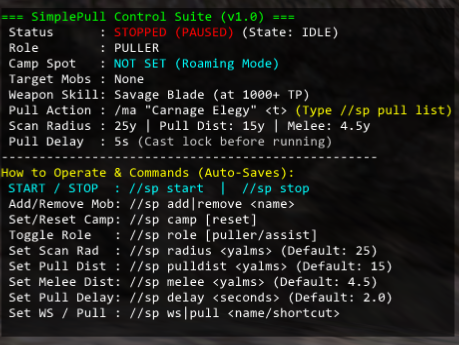
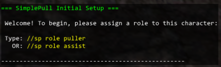

# SimplePull (v1.0)

SimplePull is a lightweight, zero-dependency Windower 4 addon for Final Fantasy XI. Designed as a lean alternative to bloated, over-complicated botting suites, SimplePull offers a bulletproof, modular approach to automated camp pulling, auto-assisting, and weapon skill execution for multiboxers. 

## Features

* **Zero Bloat:** No external C# programs, no massive dependency trees, and no complex XML pathfinding files.
* **Packet-Injected Snap Targeting:** Bypasses FFXI's clunky chat parser. Injects `0x058` packets directly into memory for instant, camera-independent target locking.
* **Smart Cooldown Guards:** Automatically reads job ability and spell recasts from memory. Your character will patiently hold at camp until your pull spell is ready.
* **Casting Lockouts:** Halts movement while casting spells like *Carnage Elegy* or *Dia* to prevent interruptions, only running back to camp after the spell lands.
* **Strict Camp Leashing:** Prevents your character from wandering across the zone or running into walls. If a mob drags you outside your scan radius, the bot aborts the pull and sprints home.
* **Roaming Mode:** Don't want to lock down a camp? Run the bot without a camp set, and it will dynamically pull and engage monsters wherever you wander.
* **Per-Character Auto-Saving:** Every setting is saved locally to the specific character. No bleeding configurations between your main and your alts.

---

## Installation

1. Download or clone this repository.
2. Place the folder into your Windower addons directory: `Windower4/addons/SimplePull/`
3. Ensure the main script is named `SimplePull.lua`.
4. In the game, type `//load simplepull` (or add it to your `init.txt` to load automatically).

---

## First-Time Setup

When you load SimplePull for the very first time on a character, the main Control Suite will be hidden. You will be greeted with the Initial Setup intercept to prevent the bot from doing anything unexpected.

You must configure your character's role before the main HUD unlocks:
* **For your puller:** Type `//sp role puller`
* **For your alts:** Type `//sp role assist`, followed by `//sp leader <YourPullersName>`

---

## Command Reference

All commands begin with `//simplepull` or `//sp`. Settings save automatically per character.

### Core Controls
| Command | Action |
| :--- | :--- |
| `//sp start` | Starts the automation suite. |
| `//sp stop` | Pauses the suite and drops you to an IDLE state. |

### Camp & Target Management
| Command | Action |
| :--- | :--- |
| `//sp camp` | Locks your current X/Y/Z coordinates as the camp return spot. |
| `//sp camp reset` | Clears your camp spot and shifts the bot into **Roaming Mode**. |
| `//sp add <name>` | Adds a mob to your hunt list (Case-Insensitive). |
| `//sp remove <name>`| Removes a mob from your hunt list. |
| `//sp clear` | Wipes your entire target list. |

### Combat Configuration
| Command | Action |
| :--- | :--- |
| `//sp pull list` | Opens an interactive UI showing all valid pulling shortcuts. |
| `//sp pull <spell>` | Sets your pull action (e.g., `//sp pull provoke`, `//sp pull dia`). *Note: `/attack` is strictly disabled as a pull mechanism.* |
| `//sp ws <name>` | Sets your Weapon Skill (e.g., `//sp ws Savage Blade`). |
| `//sp tp <amount>` | Sets the TP threshold for firing your WS (e.g., `//sp tp 1000`). |

### Distance & Timing Thresholds
| Command | Action |
| :--- | :--- |
| `//sp radius <yalms>` | Sets max scanning and leash radius from camp (Default: `25`). |
| `//sp pulldist <yalms>`| Sets max distance to execute your pull action (Default: `15`). |
| `//sp melee <yalms>` | Sets engagement/WS range (Default: `4.5`). |
| `//sp delay <seconds>` | Sets the casting lockout time before running back to camp (Default: `2.0`). |

---

## Quick Start Example (3-Box Setup)

**1. On Your Main (The Puller):**
1. Run to your desired leveling hallway.
2. Type `//sp camp` to anchor your spot.
3. Type `//sp add Colibri` to set your target.
4. Type `//sp pull provoke` or `//sp pull elegy` to set your pull method.
5. Type `//sp start`.

**2. On Your Alts (The Assist Squad):**
1. Stand them near the puller's camp spot.
2. Type `//sp role assist` and `//sp leader <PullerName>`.
3. Type `//sp ws Savage Blade` and `//sp tp 1000`.
4. Type `//sp start`.

Your alts will now stand completely still while the puller runs out, grabs the mob, and brings it back. The exact millisecond the puller draws their weapons at camp, the alts will lock on, engage, and start swinging!
